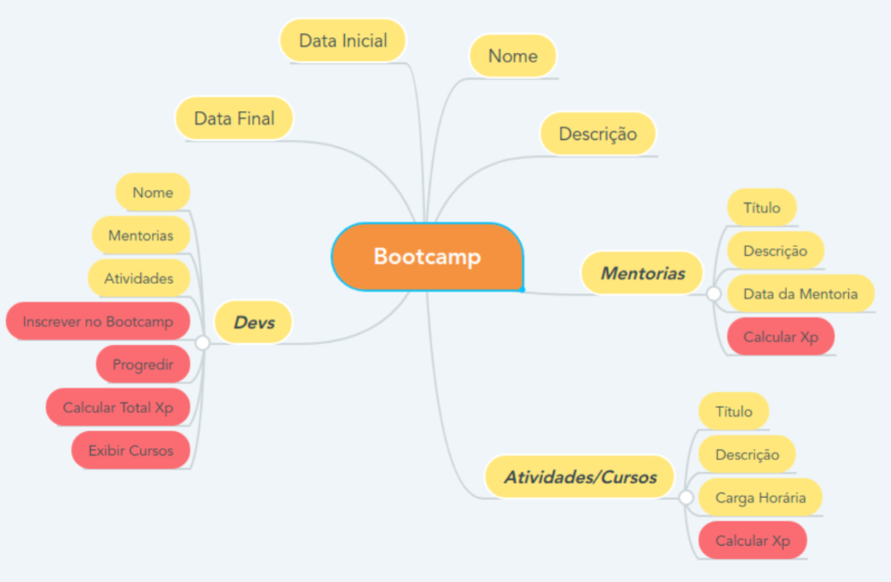

<h1> Desafio: Aprenda na Prática Programação Orientada a Objetos</h1>

 O objetivo principal desse projeto é colocar em prática os 4 pilares da orientação a objetos: <strong>ABSTRAÇÃO, ENCAPSULAMENTO, HERANÇA E POLIMORFISMO,</strong> através de um projeto Java. 

 Para isso, foi abstraido um bootcamp conforme a imagem a baixo:

